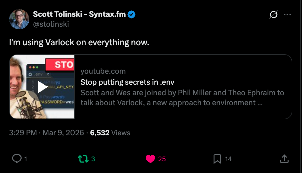

March was a huge month for Varlock! Thanks to everyone who discovered, tried out, and shared Varlock with the world. Special thanks for all of the new contributions and feedback from the community.

_Be like Scott!_

## 🔧 Core Improvements

March included a large set of core changes across features, reliability, and DX (all available in [`varlock@0.7.0`](https://github.com/dmno-dev/varlock/releases/tag/varlock%400.7.0)).

### Features

- **Single-file ESM and TypeScript plugins** - Plugin authors can now write single-file plugins in `.mjs` and `.ts` (in addition to `.js`/`.cjs`). See the [plugin guide](/guides/plugins).
- **Explicit `plugin` imports** - Plugins now import `plugin` directly from `varlock/plugin-lib`, with better compatibility across regular installs and Bun-compiled binaries.
- **`varlock typegen` command** - Added environment-independent type generation as a first-class command. See [`varlock typegen` docs](/reference/cli-commands/#typegen).
- **`ifs()` function and improved `remap()`** - New Excel-style conditional function plus positional arg pairs for `remap()`. See [`ifs()` docs](/reference/functions#ifs) and [`remap()` docs](/reference/functions#remap).
- **`@setValuesBulk(enabled=...)`** - Bulk value loading can now be conditionally enabled. See [`@setValuesBulk()` docs](/reference/root-decorators/#setvaluesbulk).
- **Custom env load path via `package.json`** - More flexible loading behavior for app/workspace setups. See [`varlock.loadPath` docs](/reference/cli-commands/#packagejson-configuration).
- **Plugin standard variable detection** - Plugins can declare expected env vars to surface better wiring warnings.
- **Relaxed header divider requirement** - Header comment blocks no longer require a trailing divider before first config item. See [root decorator header docs](/reference/root-decorators).

### Fixes and Reliability

- **Import condition correctness** - `@import(enabled=...)` and `@disable` now correctly see values from auto-loaded files such as `.env`, `.env.local`, and env-specific variants.
- **Shell output safety** - `varlock load --format shell` now safely escapes special characters to avoid shell expansion/injection issues.
- **Plugin loading stability** - Multiple fixes for plugin loading in SEA binaries, Windows file URL handling, and monorepo/workspace resolution.
- **Container and runtime resilience** - Fixed crashes when config directories are not writable (common in containers/Kubernetes) and added `XDG_CONFIG_HOME` support.
- **CLI behavior consistency** - Improved invalid load path handling (`CliExitError`), corrected `printenv` positional argument resolution, and fixed telemetry-disable messaging.
- **Docker on Alpine** - Added required runtime libraries to avoid startup failures.
- **Runtime edge-case fixes** - Addressed issues like deferred auth/error handling in plugin resolution and `patchGlobalResponse` behavior impacting `fetch` checks.

### Developer Experience

- **Bun/runtime checks** - Enforced minimum Bun version checks at runtime and improved version-check behavior.
- **Type generation polish** - Added a `ts-nocheck` directive to generated type output. Thanks [@developerzeke](https://github.com/developerzeke).
- **Improved docs/help quality** - Lots of docs updates and integration guidance improvements, including the [direnv integration docs](/integrations/direnv) and the [CLI reference](/reference/cli-commands).

## 🚀 New Integrations and Plugins

The Varlock ecosystem grew this month with new integrations and plugins:

- **[`@varlock/cloudflare-integration@0.0.1`](https://github.com/dmno-dev/varlock/releases/tag/%40varlock%2Fcloudflare-integration%400.0.1)** - New Cloudflare Workers integration, including a Vite plugin and `varlock-wrangler` workflow for safer secret handling in deploys and local dev.
- **[`@varlock/expo-integration@0.0.1`](https://github.com/dmno-dev/varlock/releases/tag/%40varlock%2Fexpo-integration%400.0.1)** - First Expo integration release. Thanks [@andychallis](https://github.com/andychallis).
- **[`@varlock/dashlane-plugin@0.0.1`](https://github.com/dmno-dev/varlock/pull/501)** - New Dashlane plugin for resolving secrets via the Dashlane CLI. Thanks [@LucasPicoli](https://github.com/LucasPicoli).
- **[`@varlock/keepass-plugin@0.0.2`](https://github.com/dmno-dev/varlock/releases/tag/%40varlock%2Fkeepass-plugin%400.0.2)** - Added KeePass support with flexible resolver options for KDBX-based workflows. Thanks [@qades](https://github.com/qades).
- **[`dmno-dev/varlock-action@v1.0.1`](https://github.com/dmno-dev/varlock-action/releases/tag/v1.0.1)** - Latest GitHub Action release for validating and loading env vars with Varlock in CI.
- **[`env-spec-language@0.1.0`](https://github.com/dmno-dev/varlock/releases/tag/env-spec-language%400.1.0)** - New language tooling release with IntelliSense and inline diagnostics support for editor workflows. Thanks [@voiys](https://github.com/voiys).

## 🌐 Content Highlights

We loved seeing strong community engagement this month:

- Varlock was featured on [Syntax](https://www.youtube.com/watch?v=M5IkBp0AEN8), and we saw a wave of new users and stars.
- Better Stack published a video on why Varlock is better than `.env`: [Watch here](https://www.youtube.com/watch?v=nxH-BrsCPTo).
- We were featured in [One Tip a Week](https://one-tip-a-week.beehiiv.com/p/one-tip-a-week-stop-shipping-broken-env-config?utm_source=one-tip-a-week.beehiiv.com&utm_medium=newsletter&utm_campaign=one-tip-a-week-stop-shipping-broken-env-config&_bhlid=e2ca113a026a3b23657be4e01e69ef51035f5bba), a newsletter we really enjoy by [Nick Taylor](https://x.com/nickytonline).
- Schalk Neethling published [Stop Storing Secrets on Disk - Replace Your .env With Varlock and 1Password](https://schalkneethling.com/posts/stop-storing-secrets-on-disk-replace-your-env-with-varlock-and-1password/), a great walkthrough of moving secrets out of local `.env` files.
- Jesse.ID shared [Using varlock to pull secrets from 1Password at runtime](https://jesse.id/blog/posts/using-varlock-to-pull-secrets-from-1password-at-runtime), including a practical setup and lessons learned.

## 💬 Community

We're always looking for feedback and ideas. Join our growing community:

- [Discord](https://chat.dmno.dev) - Chat with us and other users.
- [GitHub Discussions](https://github.com/dmno-dev/varlock/discussions) - Suggestions, questions, and feature ideas.
- [GitHub](https://github.com/dmno-dev/varlock) - Star the project and follow us on GitHub.
- [X](https://x.com/varlockdev) - Follow us on X.
- [Bluesky](https://bsky.app/profile/varlock.dev) - Follow us on Bluesky.
