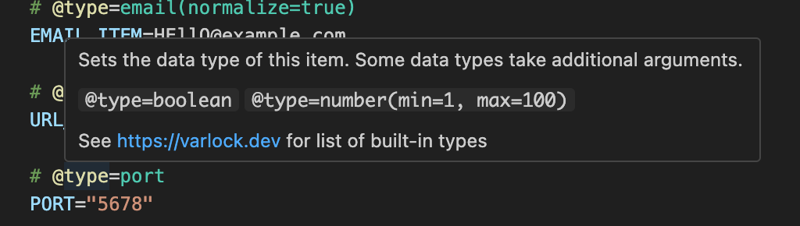

The @env-spec VS Code extension provides syntax highlighting for .env files with support for all of `@env-spec`.

## Installation

The extension is available on the [VS Code Marketplace](https://marketplace.visualstudio.com/items?itemName=varlock.env-spec).

## IntelliSense

You get IntelliSense for known @decorators. For example:

