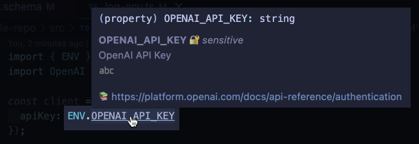

import ExecCommandWidget from "@/components/ExecCommandWidget.astro";

## From dotenv

In most [Node.js](/integrations/javascript) apps, you can replace `dotenv/config` with `varlock/auto-load` after [installing varlock](/getting-started/installation).

```diff title="index.js" lang="js"
// Before (dotenv)
- import 'dotenv/config';

// After (varlock)
+ import 'varlock/auto-load';
```

See our [migrate from dotenv](/guides/migrate-from-dotenv) guide for more information.

## From specific integrations

If you're currently using `import.meta.env` or `process.env`, your code will still work after switching to varlock. However, we recommend using varlock's `ENV` object for better type-safety and improved developer experience.

```diff title="index.js" lang="js"
// Before (import.meta.env)
- console.log(import.meta.env.SOMEVAR);

// After (ENV)
import { ENV } from 'varlock/env';
+ console.log(ENV.SOMEVAR);
```



See our [integrations](/integrations/overview) section for more information.