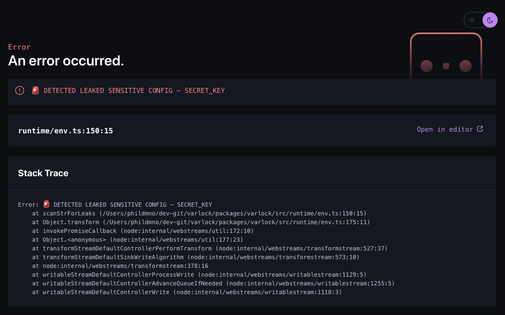

import Decorator from '@/components/decorator-doc-entry.astro'

Root decorators appear in the _header_ section of a .env file - which is a comment block at the beginning of the file that ends with a divider. Usually root decorators are used only in your `.env.schema` file.


```env-spec title=".env.schema"
# This is the header, it can contain root decorators
# @defaultSensitive=false @defaultRequired=infer
# @generateTypes(lang=ts, path=./env.d.ts)
# ---
# ... config items
```


More details of the minutiae of decorator handling can be found in the [@env-spec reference](/env-spec/reference/#comments-and-decorators).

## Built-in root decorators

These are the root decorators that are built into Varlock. [Plugins](/guides/plugins/) may introduce more.

<div class="reference-docs">

<div>
### `@currentEnv`
**Value type:** [`ref()`](/reference/functions/#ref) (usually written as `$ITEM_NAME`)

Sets the current _environment_ value, which will be used when determining if environment-specific .env files will be loaded (e.g. `.env.production`),
and also may affect other dynamic behaviour in your schema, such as the [`forEnv()` function](/reference/functions/#forenv). We refer to the name of this item as your _environment flag_.

- It _must_ be set to a simple reference to a single config item (e.g. `$APP_ENV`).
- This decorator should only be set in your `.env.schema` file.
- The referenced item _must_ be defined within the same file.
- This will override the `--env` CLI flag if it is set.
- We do not recommend using `NODE_ENV` as your environment flag, as it has other implications, and is often set out of your control.

See [environments guide](/guides/environments) for more info.

```env-spec
# @currentEnv=$APP_ENV
# ---
# @type=enum(dev, preview, prod, test)
APP_ENV=dev
```
</div>

<div>
### `@envFlag` (deprecated) ||envflag||
**Value type:** `string` (must be a valid item name within same file)

Sets the current _environment flag_ by name.

⚠️ Deprecated at v0.1 - use [`@currentEnv`](#currentenv) instead.

`@envFlag=APP_ENV` -> `@currentEnv=$APP_ENV`
</div>


<div>
### `@defaultRequired`
**Value type:** `boolean | "infer"`

Sets the default behavior of each item being _required_. Only applied to items that have a definition within the same file. Can be overridden on individual items using [`@required`](/reference/item-decorators/#required)/[`@optional`](/reference/item-decorators/#optional).

- `infer` (default): Items with a value set in the same file will be required; items with an empty string or no value are optional.
- `true`: All items are required unless marked optional.
- `false`: All items are optional unless marked required.

```env-spec
# @defaultRequired=infer
# ---

FOO=bar        # required (static value)
BAR=fnCall()   # required (function value)
BAZ=           # optional (no value)
QUX=''         # optional (empty string)

# @optional
OPTIONAL_ITEM=foo # optional (explicit)

# @required
REQUIRED_ITEM= # required (explicit)
```
</div>

<div>
### `@defaultSensitive`
**Value type:** `boolean | inferFromPrefix(PREFIX)`

Sets the default state of each item being treated as [_sensitive_](/guides/secrets/). Only applied to items that have a definition within the same file. Can be overridden on individual items using [`@sensitive`](/reference/item-decorators/#sensitive).

- `true` (default): All items are sensitive unless marked otherwise.
- `false`: All items are not sensitive unless marked otherwise.
- `inferFromPrefix(PREFIX)`: Item is marked not sensitive if key starts with the given `PREFIX`; all others are sensitive. Useful for marking e.g. `PUBLIC_` keys as non-sensitive by default.

```env-spec
# @defaultSensitive=inferFromPrefix(PUBLIC_)
# ---

PUBLIC_FOO= # not sensitive (due to matching prefix)
OTHER_FOO=  # sensitive (default when prefix does not match)

# @sensitive
PUBLIC_BAR= # sensitive (explicit decorator overrides prefix)
# @sensitive=false
OTHER_BAR=  # not sensitive (explicit)
```
</div>

<div>
### `@disable`
**Value type:** `boolean`

If true, disables loading the file - meaning no items or plugins are loaded from it. Useful for temporarily or conditionally disabling a `.env` file.

💡 The [`forEnv()`](/reference/functions/#forenv) function can disable an explicitly [imported](/guides/import/) file based on the current [environment](/guides/environments/).

```env-spec
# @disable  # (shorthand for @disable=true)
#
# @plugin(@varlock/x-plugin)  # will not be loaded
# ---
FOO=bar  # will be ignored
```


</div>

<div>
### `@import()`
**Arg types:** `[ path: string, ...keys?: string[] ]`  
**Named args:** `enabled?: boolean`, `allowMissing?: boolean`

Imports other `.env` file(s) - useful for sharing config across monorepos and splitting up large schemas. _Can be called multiple times._

You may import a specific file, or a directory of files - automatically loading all `.env.*` files appropriately according to the current environment flag.

The optional `enabled` parameter allows conditional imports based on boolean expressions. It defaults to `true` if not specified.

The optional `allowMissing` parameter makes the import optional - if set to `true`, the import will be silently skipped if the file or directory doesn't exist instead of causing a loading error. It defaults to `false` if not specified.

See the [imports guide](/guides/import/) for more details and advanced usage.

```env-spec
# @import(./.env.imported)                        # import a specific file
# @import(./.env.other, KEY1, KEY2)               # import specific keys
# @import(../shared-env/)                         # import a directory
# @import(~/.env.shared)                          # import from home directory
# @import(./.env.dev, enabled=eq($ENV, "dev"))    # conditional import
# @import(./.env.local, allowMissing=true)        # optional import (no error if missing)
# ---

# this definition is merged with any found in imports, but this one has more precedence
IMPORTED_ITEM=overriden-value
```
</div>

<div>
### `@plugin()`
**Arg types:** `[ identifier: string ]`

Loads a plugin, which can register new root decorators, item decorators, and resolver functions. _Can be called multiple times._

See [plugins guide](/guides/plugins/) for more details.

```env-spec
# @plugin(@varlock/1password-plugin)
# @initOp(allowAppAuth=true) # new root decorator
# ---
# @type=opServiceAccountToken # new data type
OP_TOKEN=
# @sensitive
XYZ_API_KEY=op(op://api-prod/xyz/api-key) # new resolver
```
</div>


<div>
### `@generateTypes()`
**Arg types (key/value):**
- `lang`: Language to generate types for. Supported languages:
  - `ts` - TypeScript
- `path`: Relative filepath to output generated type file
- `executeWhenImported`: overrides the default behaviour of not executing when the containing file is imported (defaults to `false`)

Enables automatic type generation based on your schema. _Can be called multiple times._

```env-spec
# @generateTypes(lang=ts, path=./env.d.ts)
# ---
```

:::tip 
Usually this decorator will live in your primary `.env.schema` file, and it will be ignored if it is within an imported file.

To override this behaviour, set `executeWhenImported` to `true`.
:::

</div>

<div>
### `@redactLogs`
**Value type:** `boolean`

Controls whether sensitive config values are automatically redacted from console output. When enabled, any sensitive values will be replaced with `▒▒▒▒▒` in logs.

_Only applies in JavaScript based projects where varlock runtime code is imported._

- `true` (default): Console logs are automatically redacted
- `false`: Console logs are not redacted (useful for debugging)

```env-spec
# @redactLogs=false
# ---
SECRET_KEY=my-secret-value # @sensitive
```

```js
console.log(process.env.SECRET_KEY)
// This will log "my▒▒▒▒▒" instead of "my-secret-value" when @redactLogs=true
```


:::caution
There is a potential performance impact for both `@preventLeaks` and `@redactLogs` when enabled. It depends on the integration and how your application is served. Please [reach out](https://chat.dmno.dev) if you have any questions.

We feel that they are beneficial enough to have them on by default but you can always opt out if you prefer.
:::

</div>


<div>
### `@preventLeaks`
**Value type:** `boolean`

Controls whether leak prevention is enabled. When enabled, varlock will scan outgoing HTTP responses to detect if sensitive values are being leaked.

_Only applies in JavaScript based projects where varlock runtime code is imported._

**Options:**
- `true` (default): Leak detection is enabled
- `false`: Leak detection is disabled (useful for debugging)

```env-spec
# @preventLeaks=false
# ---
SECRET_KEY=my-secret-value # @sensitive
```


_a sample leak detection warning in an [Astro project](/integrations/astro/)_


:::caution
See note on [`@redactLogs`](#redactlogs) about potential performance impact.
:::

</div>

</div>
