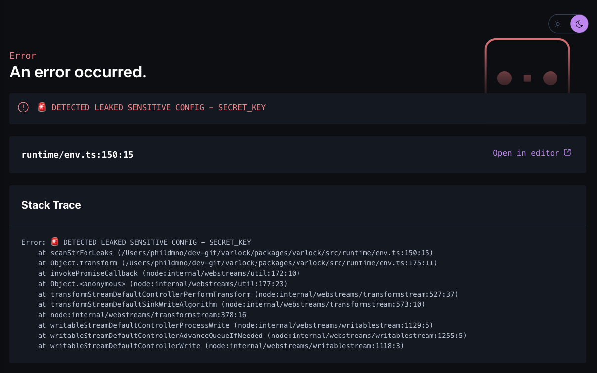

import Decorator from '@/components/decorator-doc-entry.astro'

Root decorators appear in the _header_ section of a .env file - which is any comment block(s) at the beginning of the file, before the first config item. Usually root decorators are used only in your `.env.schema` file.


```env-spec title=".env.schema"
# This is the header, it can contain root decorators
# @defaultSensitive=false @defaultRequired=infer
# @generateTypes(lang=ts, path=./env.d.ts)
```


More details of the minutiae of decorator handling can be found in the [@env-spec reference](/env-spec/reference/#comments-and-decorators).

## Built-in root decorators

These are the root decorators that are built into Varlock. [Plugins](/guides/plugins/) may introduce more.

<div class="reference-docs">

<div>
### `@currentEnv`
**Value type:** [`ref()`](/reference/functions/#ref) (usually written as `$ITEM_NAME`)

Sets the current _environment_ value, which will be used when determining if environment-specific .env files will be loaded (e.g. `.env.production`),
and also may affect other dynamic behaviour in your schema, such as the [`forEnv()` function](/reference/functions/#forenv). We refer to the name of this item as your _environment flag_.

- It _must_ be set to a simple reference to a single config item (e.g. `$APP_ENV`).
- This decorator should only be set in your `.env.schema` file.
- The referenced item _must_ be defined within the same file.
- This will override the `--env` CLI flag if it is set.
- We do not recommend using `NODE_ENV` as your environment flag, as it has other implications, and is often set out of your control.

See [environments guide](/guides/environments) for more info.

```env-spec
# @currentEnv=$APP_ENV
# ---
# @type=enum(dev, preview, prod, test)
APP_ENV=dev
```
</div>

<div>
### `@envFlag` (deprecated) ||envflag||
**Value type:** `string` (must be a valid item name within same file)

Sets the current _environment flag_ by name.

⚠️ Deprecated at v0.1 - use [`@currentEnv`](#currentenv) instead.

`@envFlag=APP_ENV` -> `@currentEnv=$APP_ENV`
</div>


<div>
### `@defaultRequired`
**Value type:** `boolean | "infer"`

Sets the default behavior of each item being _required_. Only applied to items that have a definition within the same file. Can be overridden on individual items using [`@required`](/reference/item-decorators/#required)/[`@optional`](/reference/item-decorators/#optional).

- `infer` (default): Items with a value set in the same file will be required; items with an empty string or no value are optional.
- `true`: All items are required unless marked optional.
- `false`: All items are optional unless marked required.

```env-spec
# @defaultRequired=infer
# ---

FOO=bar        # required (static value)
BAR=fnCall()   # required (function value)
BAZ=           # optional (no value)
QUX=''         # optional (empty string)

# @optional
OPTIONAL_ITEM=foo # optional (explicit)

# @required
REQUIRED_ITEM= # required (explicit)
```
</div>

<div>
### `@defaultSensitive`
**Value type:** `boolean | inferFromPrefix(PREFIX)`

Sets the default state of each item being treated as [_sensitive_](/guides/secrets/). Only applied to items that have a definition within the same file. Can be overridden on individual items using [`@sensitive`](/reference/item-decorators/#sensitive).

- `true` (default): All items are sensitive unless marked otherwise.
- `false`: All items are not sensitive unless marked otherwise.
- `inferFromPrefix(PREFIX)`: Item is marked not sensitive if key starts with the given `PREFIX`; all others are sensitive. Useful for marking e.g. `PUBLIC_` keys as non-sensitive by default.

📖 See the [secrets management guide](/guides/secrets/) for best practices on handling sensitive values, and how to use plugins to fetch them from secret management platforms.

```env-spec
# @defaultSensitive=inferFromPrefix(PUBLIC_)
# ---

PUBLIC_FOO= # not sensitive (due to matching prefix)
OTHER_FOO=  # sensitive (default when prefix does not match)

# @sensitive
PUBLIC_BAR= # sensitive (explicit decorator overrides prefix)
# @sensitive=false
OTHER_BAR=  # not sensitive (explicit)
```
</div>

<div>
### `@defaultDynamic`
**Value type:** `boolean | "sensitive"`

Sets the default state of each item being treated as _dynamic_ (runtime-resolved) vs _static_ (eligible for build-time replacement). Only applied to items that have a definition within the same file. Can be overridden on individual items using [`@dynamic`](/reference/item-decorators/#dynamic)/[`@static`](/reference/item-decorators/#static).

- `"sensitive"` (default): Dynamic behavior follows sensitivity.
- `true`: All items are dynamic unless explicitly marked static.
- `false`: All items are static unless explicitly marked dynamic.

```env-spec
# @defaultSensitive=inferFromPrefix(PUBLIC_)
# @defaultDynamic=sensitive
# ---

PUBLIC_FOO= # static by default (public)
SECRET_BAR= # dynamic by default (sensitive)
```
</div>

<div>
### `@disable`
**Value type:** `boolean`

If true, disables loading the file - meaning no items or plugins are loaded from it. Useful for temporarily or conditionally disabling a `.env` file.

💡 The [`forEnv()`](/reference/functions/#forenv) function can disable an explicitly [imported](/guides/import/) file based on the current [environment](/guides/environments/).

```env-spec
# @disable  # (shorthand for @disable=true)
#
# @plugin(@varlock/x-plugin)  # will not be loaded
# ---
FOO=bar  # will be ignored
```


</div>

<div>
### `@import()`
**Arg types:** `[ path: string, ...keys?: string[] ]`  
**Named args:** `enabled?: boolean`, `allowMissing?: boolean`

Imports other `.env` file(s) - useful for sharing config across monorepos and splitting up large schemas. _Can be called multiple times._

You may import a specific file, or a directory of files - automatically loading all `.env.*` files appropriately according to the current environment flag.

The optional `enabled` parameter allows conditional imports based on boolean expressions. It defaults to `true` if not specified.

The optional `allowMissing` parameter makes the import optional - if set to `true`, the import will be silently skipped if the file or directory doesn't exist instead of causing a loading error. It defaults to `false` if not specified.

See the [imports guide](/guides/import/) for more details and advanced usage.

```env-spec
# @import(./.env.imported)                        # import a specific file
# @import(./.env.other, KEY1, KEY2)               # import specific keys
# @import(../shared-env/)                         # import a directory
# @import(~/.env.shared)                          # import from home directory
# @import(./.env.dev, enabled=eq($ENV, "dev"))    # conditional import
# @import(./.env.local, allowMissing=true)        # optional import (no error if missing)
# ---

# this definition is merged with any found in imports, but this one has more precedence
IMPORTED_ITEM=overridden-value
```
</div>

<div>
### `@setValuesBulk()`
**Arg types:** `[ data: string ]`
**Named args:** `format?: "json" | "env"`, `createMissing?: boolean`, `enabled?: boolean`

Injects multiple config values at once from an external data source. The first argument is a resolver that produces a string (e.g., `exec()` calling a secrets manager), which is parsed and injected as definitions within the file containing the decorator.

Bulk values participate in the normal file override chain — `process.env` still overrides everything, higher-precedence files (`.env.local`, `.env.production`, etc.) override bulk values, and bulk values override schema-defined defaults in the same file. You control precedence by choosing which file to put `@setValuesBulk` in.

**Options:**
- `format`: How to parse the data string. `json` expects a flat JSON object, `env` expects `.env` file format. If not specified, auto-detected by checking if the string starts with `{`.
- `createMissing`: If `true`, keys in the bulk data that don't already exist in your schema will be created as new config items. Defaults to `false` (unknown keys are silently skipped).
- `enabled`: If `false`, the bulk data resolver is skipped entirely. Accepts any boolean expression, including dynamic references to other config items. Defaults to `true`.

_Can be called multiple times — later calls overwrite earlier ones for the same keys._

```env-spec title=".env.schema"
# Inject secrets from a vault as JSON
# @setValuesBulk(exec("vault kv get -format=json secret/myapp"), format=json)
# ---
API_KEY=
DB_PASSWORD=
```

```env-spec title=".env.schema"
# Inject from a secrets file as .env format
# @setValuesBulk(exec("cat /run/secrets/env"), format=env)
# ---
API_KEY=
DB_PASSWORD=
```

```env-spec title=".env.schema"
# Create items not already in the schema
# @setValuesBulk(exec("vault kv get -format=json secret/myapp"), format=json, createMissing=true)
```

```env-spec title=".env.schema"
# Only fetch from the vault in non-production environments
# @setValuesBulk(exec("vault kv get -format=json secret/dev"), format=json, enabled=eq($APP_ENV, "dev"))
# ---
API_KEY=
APP_ENV=dev
```

:::note
When using `format=env`, function calls like `$VAR` references in unquoted values are not supported and will cause an error. Use single quotes for literal `$` signs (e.g., `'$LITERAL'`) or use `format=json` instead.
:::

:::caution[`createMissing` and type generation]
Items created via `createMissing=true` — those that don't already exist in your schema — **will not be included in generated TypeScript types**. Type generation happens at build/schema-load time before values are fetched, so dynamically created keys are invisible to the type generator.

For this reason, **`createMissing=true` is not recommended**. Instead, declare all expected items explicitly in your schema (with an empty value) so they are known at type-generation time.
:::

</div>

<div>
### `@plugin()`
**Arg types:** `[ identifier: string ]`

Loads a plugin, which can register new root decorators, item decorators, and resolver functions. _Can be called multiple times._

See [plugins guide](/guides/plugins/) for more details.

```env-spec
# @plugin(@varlock/1password-plugin)
# @initOp(allowAppAuth=true) # new root decorator
# ---
# @type=opServiceAccountToken # new data type
OP_TOKEN=
# @sensitive
XYZ_API_KEY=op(op://api-prod/xyz/api-key) # new resolver
```
</div>


<div>
### `@cache`
**Value type:** `"auto" | "memory" | "disk" | "disabled"`

Sets global cache mode for [`cache()`](/reference/functions/#cache) and plugin cache APIs.

**Modes:**
- `memory`: cache only in-process (not persisted)
- `disk`: cache to encrypted disk storage (persists across invocations)
- `disabled`: disable caching globally
- `auto` (default): uses `disk` when a native encryption backend is available outside CI; otherwise uses `disk` encrypted with `_VARLOCK_CACHE_KEY` if that env var is set, falling back to `memory` (see the [Caching guide](/guides/caching/))

The value can also be set dynamically with a function — for example to change cache mode per environment. A function that resolves to no value falls back to `auto`.

```env-spec
# @cache=memory
# ---
SESSION_SECRET=cache(randomHex(32))
```

```env-spec
# dynamic - only use disk caching in development
# @cache=forEnv(dev, "disk")
# ---
```

:::note
`--skip-cache` on `varlock load` / `varlock run` / `varlock printenv` disables cache reads and writes for that invocation, regardless of `@cache`.
:::

See the [Caching guide](/guides/caching/) for mode selection guidance by environment.

</div>

<div>
### `@generateTypes()`
**Arg types (key/value):**
- `lang`: Language to generate types for (currently only `ts` / TypeScript is supported, with more languages planned)
- `path`: Relative filepath to output generated type file
- `auto`: Controls whether types are generated automatically on every load (defaults to `true`). Set to `false` to disable automatic generation and instead run [`varlock typegen`](/reference/cli-commands/#typegen) explicitly.
- `executeWhenImported`: overrides the default behaviour of not executing when the containing file is imported (defaults to `false`)

Triggers type generation based on your schema. _Can be called multiple times._

```env-spec
# @generateTypes(lang=ts, path=./env.d.ts)
```

:::tip
Usually this decorator will live in your primary `.env.schema` file, and it will be ignored if it is within an imported file.

To override this behaviour, set `executeWhenImported` to `true`.
:::

:::note[Disabling automatic type generation]
If you prefer to generate types manually rather than on every load, set `auto=false` and run [`varlock typegen`](/reference/cli-commands/#typegen) explicitly:

```env-spec
# @generateTypes(lang=ts, path=./env.d.ts, auto=false)
```

This is useful when you want full control over when your type definitions are updated, for example in a CI pipeline or as a dedicated build step.
:::

</div>

<div>
### `@redactLogs`
**Value type:** `boolean`

Controls whether sensitive config values are automatically redacted from console output. When enabled, any sensitive values will be replaced with `▒▒▒▒▒` in logs.

_Only applies in JavaScript based projects where varlock runtime code is imported._

- `true` (default): Console logs are automatically redacted
- `false`: Console logs are not redacted (useful for debugging)

```env-spec
# @redactLogs=false
# ---
SECRET_KEY=my-secret-value # @sensitive
```

```js
console.log(process.env.SECRET_KEY)
// This will log "my▒▒▒▒▒" instead of "my-secret-value" when @redactLogs=true
```


:::caution
There is a potential performance impact for both `@preventLeaks` and `@redactLogs` when enabled. It depends on the integration and how your application is served. Please [reach out](https://chat.dmno.dev) if you have any questions.

We feel that they are beneficial enough to have them on by default but you can always opt out if you prefer.
:::

</div>


<div>
### `@preventLeaks`
**Value type:** `boolean`

Controls whether leak prevention is enabled. When enabled, varlock will scan outgoing HTTP responses to detect if sensitive values are being leaked.

_Only applies in JavaScript based projects where varlock runtime code is imported._

**Options:**
- `true` (default): Leak detection is enabled
- `false`: Leak detection is disabled (useful for debugging)

```env-spec
# @preventLeaks=false
# ---
SECRET_KEY=my-secret-value # @sensitive
```


_a sample leak detection warning in an [Astro project](/integrations/astro/)_


:::caution
See note on [`@redactLogs`](#redactlogs) about potential performance impact.
:::

</div>

<div>
### `@encryptInjectedEnv`
**Value type:** `boolean`

Controls whether the injected env blob in server-side build output is encrypted. When enabled, varlock encrypts the blob with AES-256-GCM using the `_VARLOCK_ENV_KEY` environment variable.

This is primarily relevant for serverless deployments (Vercel, Netlify, etc.) where varlock injects resolved env data into the build output. The blob only appears in server-side code and is generally safe, but encryption provides extra protection — particularly against secrets leaking via sourcemaps.

**Options:**
- `false` (default): Blob is injected as plaintext JSON
- `true`: Blob is encrypted, `_VARLOCK_ENV_KEY` required at build time and runtime
- `forEnv(...)`: Conditionally enable based on the current environment

```env-spec
# @encryptInjectedEnv
# ---
SECRET_KEY= # @sensitive
```

```env-spec
# only encrypt in production
# @encryptInjectedEnv=forEnv(prod)
# ---
SECRET_KEY= # @sensitive
```

**Key management:**
- For **Cloudflare Workers**, the key is auto-generated and uploaded as a secret binding — no manual setup needed
- For **local dev**, a temporary key is auto-generated when running dev servers
- For **production deploys** to other platforms, you must set `_VARLOCK_ENV_KEY` on your platform — see the [encrypted deployments guide](/guides/encrypted-deployments/)
</div>

<div>
### `@disableProcessEnvInjection`
**Value type:** `boolean`

Prevents varlock from injecting resolved values into `process.env`. When enabled, env vars are only accessible via the `ENV` proxy — `process.env.MY_VAR` will not contain varlock-resolved values.

This is useful for security hardening. Combined with [`@encryptInjectedEnv`](#encryptinjectedenv), it ensures that no plaintext secrets exist in `process.env` at all.

**Options:**
- `false` (default): Values are injected into `process.env` as usual
- `true`: Values are only accessible via `ENV`
- `forEnv(...)`: Conditionally enable based on the current environment

```env-spec
# @disableProcessEnvInjection
# ---
SECRET_KEY= # @sensitive
PUBLIC_URL=
```

```env-spec
# disable process.env injection only in production
# @disableProcessEnvInjection=forEnv(prod)
# ---
SECRET_KEY= # @sensitive
```

:::caution
When enabled, any code that reads from `process.env` directly (including third-party libraries) will not see varlock-resolved values. Make sure all env access in your application goes through the `ENV` proxy.
:::

:::note
This decorator only affects the runtime `initVarlockEnv()` behavior — it does **not** affect [`varlock run`](/reference/cli-commands/#run), which always injects individual env vars into the child process by default. Use `varlock run --no-inject-vars` if you also want to skip individual var injection when using `varlock run`.
:::
</div>

<div>
### `@auditIgnorePaths()`
**Arg types:** `[ ...paths: string[] ]`

Excludes directories from the [`varlock audit`](/reference/cli-commands/#audit) code scanner. Paths are relative to the file containing the decorator. _Can be called multiple times — paths are merged additively._

Useful for excluding generated code, vendored dependencies, or directories that contain env var references you don't want to audit.

```env-spec
# @auditIgnorePaths(vendor, generated/config)
# ---
API_KEY=
```

```env-spec
# called multiple times — paths are merged
# @auditIgnorePaths(vendor)
# @auditIgnorePaths(generated/config, scripts/setup)
# ---
API_KEY=
```
</div>

</div>
