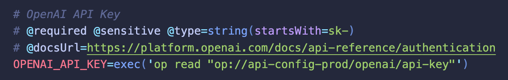
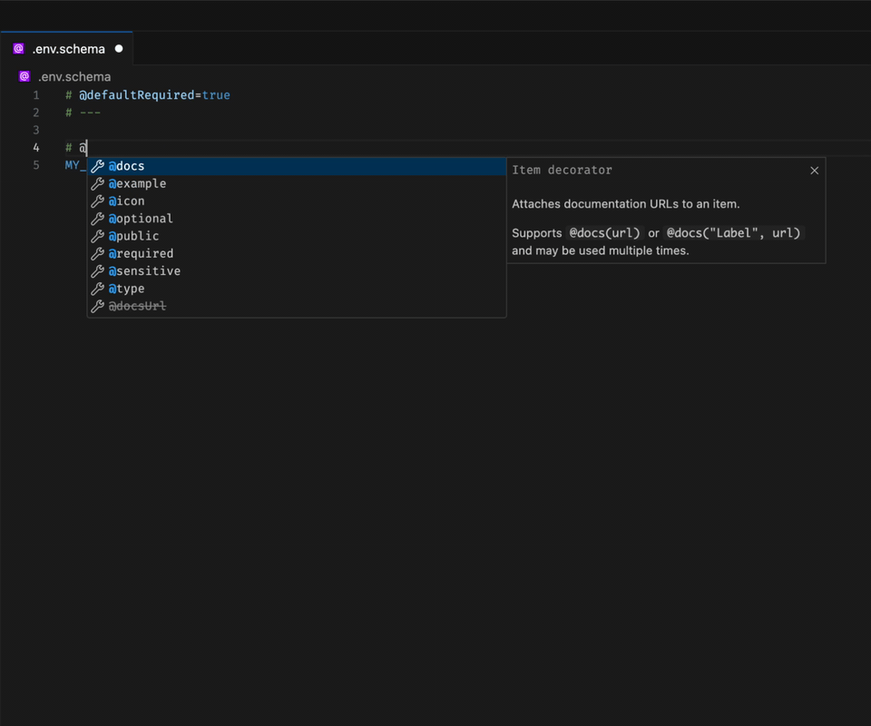
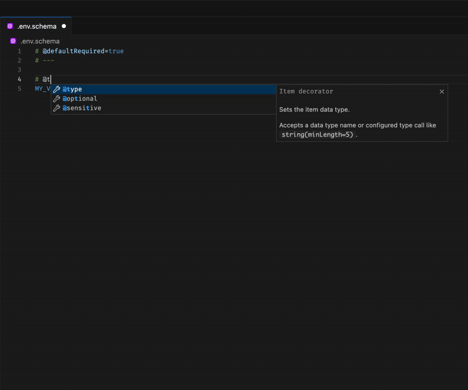
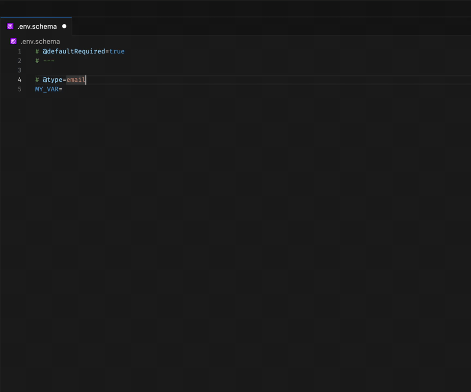
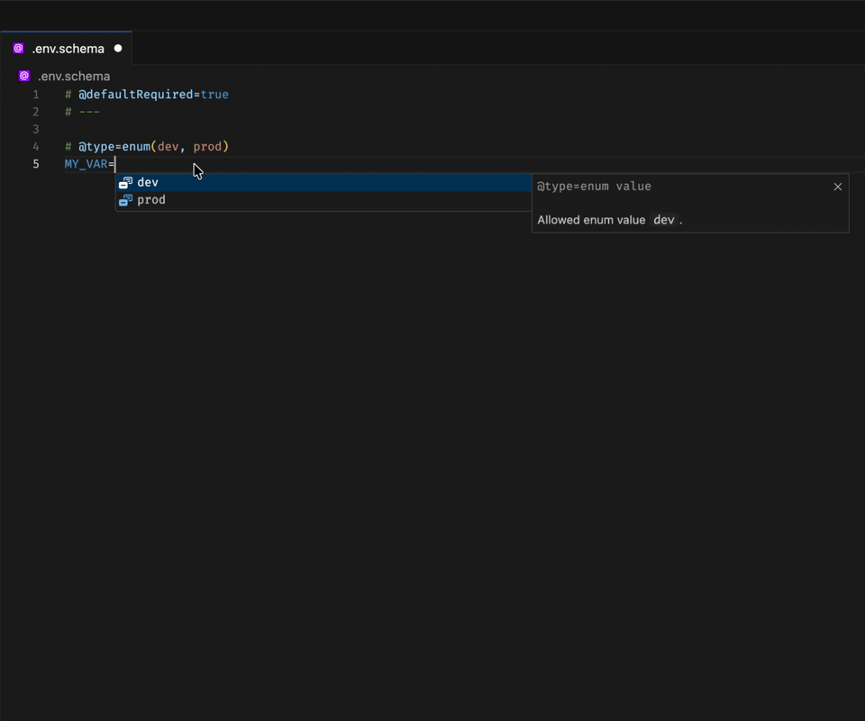
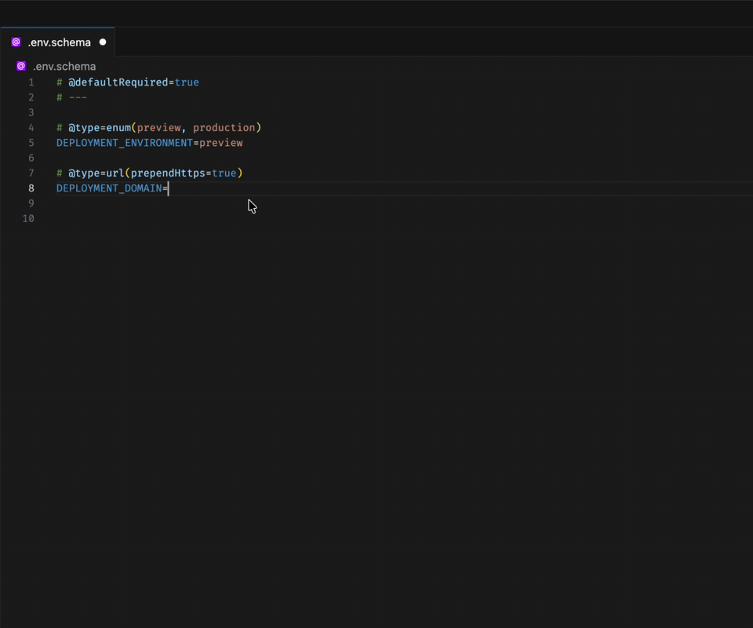
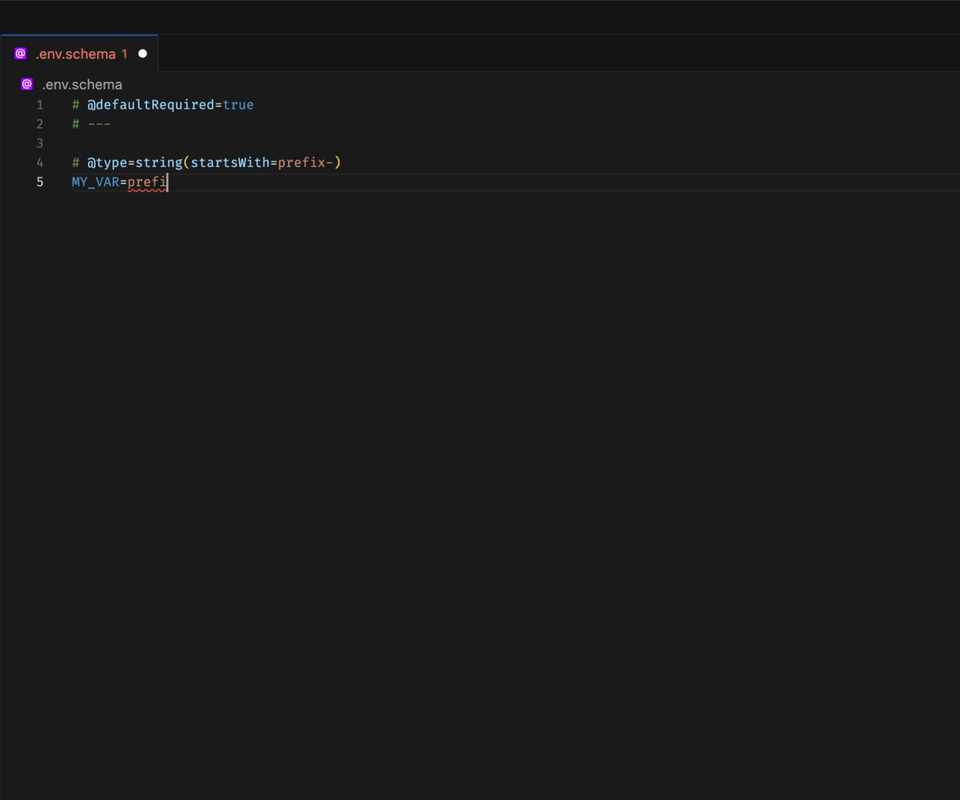
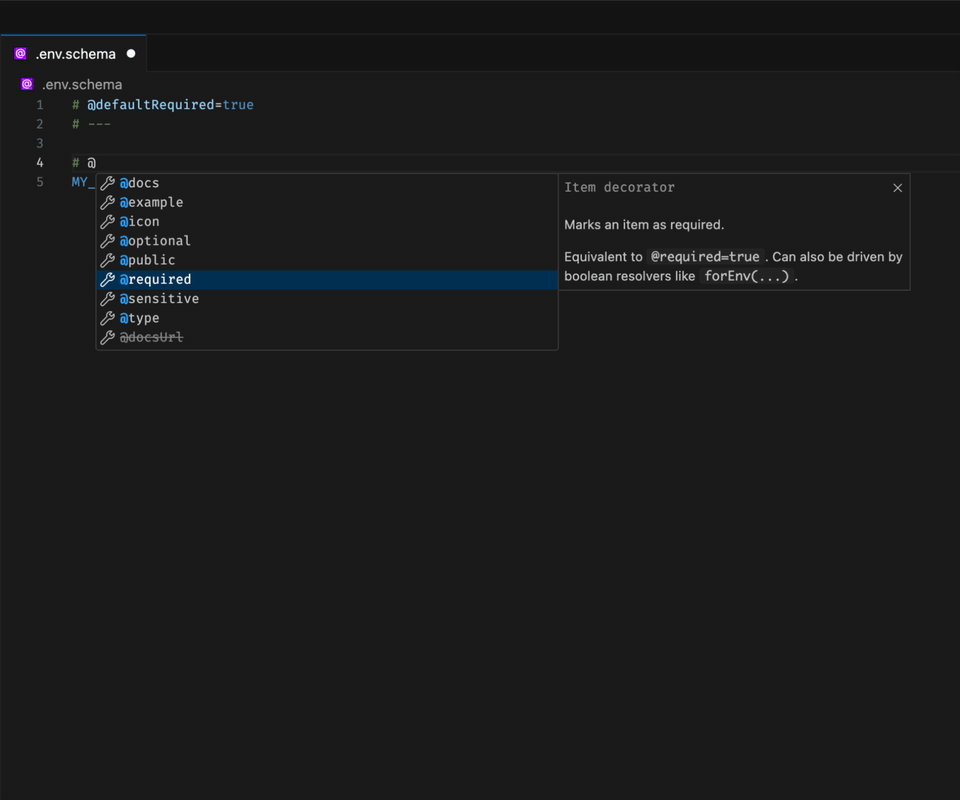
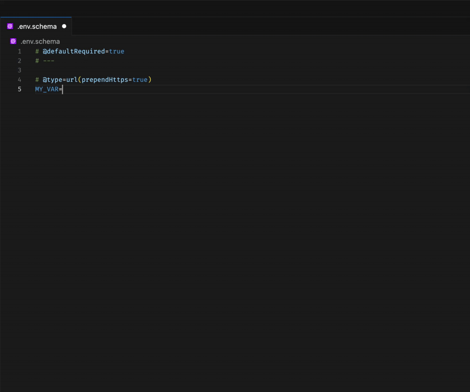

# `@env-spec` VSCode Extension

This VSCode extension adds [**@env-spec**](https://varlock.dev/env-spec) language support for your `.env` files.

This new DSL builds upon the common `.env` format, adding support for JSDoc style `@decorator` comments to provide additional metadata about your environment variables, and explicit function-call style values, to load data from external sources.

> Using **@env-spec** enabled tools (like [varlock](https://varlock.dev)) can use this additional information to securely load and validate your environment variables, without any additional custom code.

## Features

- Syntax highlighting
- IntelliSense for decorators, `@type` values, type options, resolver functions, and `$KEY` references
- Enum value completion for item values below `@type=enum(...)`
- Inline validation for invalid enum values, incompatible decorators, and obvious static `@type` mismatches
- Hover info for common `@decorators`
- Better toggle-comment behavior (CMD+/), to enable/disable decorators within comment blocks
- Comment continuation (automatically continue comment blocks when you hit enter within one)

## IntelliSense and diagnostics

### Decorators and built-in types

Get completions for common item and root decorators, plus built-in `@type=` values while editing comment blocks.

### Type option completions

Built-in types surface context-aware option completions like `email(normalize=...)`, `ip(version=..., normalize=...)`, and `url(prependHttps=...)`.

### Email-specific option completions

Type-specific completions also work for focused cases like `email(normalize=...)`, with boolean choice values suggested inline.

### Enum value completions

When an item is declared as `@type=enum(...)`, the allowed values are suggested directly on the item value line below.

### Variable references

Typing `$` inside values and decorator expressions suggests config keys from the current file.

### Prefix-aware completions

Decorator and validation workflows also support prefix-related configuration scenarios while editing schema comments.

### Invalid decorator combinations

Autocomplete filters out incompatible decorators like `@required` and `@optional`, and inline diagnostics catch invalid combinations if they still appear in the file.

### Inline validation

The extension also highlights obvious static validation issues, such as invalid enum values or incorrect `prependHttps` URL usage.

## How to use this extension

The new `@env-spec` language mode should be enabled automatically for any `.env` and `.env.*` files, but you can always set it via the Language Mode selector in the bottom right of your editor.

### Feeback, Contributing, Support

We are actively iterating on **@env-spec** and your feedback is invaluable. Please read through our [RFC](https://github.com/dmno-dev/varlock/discussions/17) and let us know what you think!

For more immediate support, or to chat with us, please join our [Discord](https://chat.dmno.dev).
